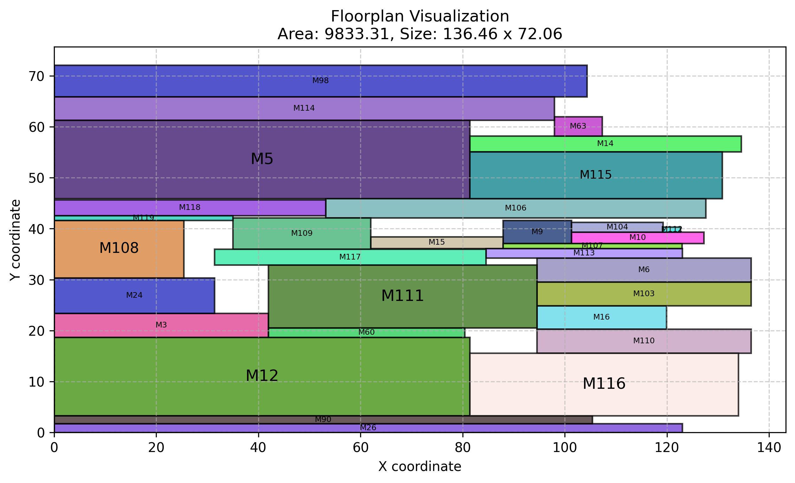
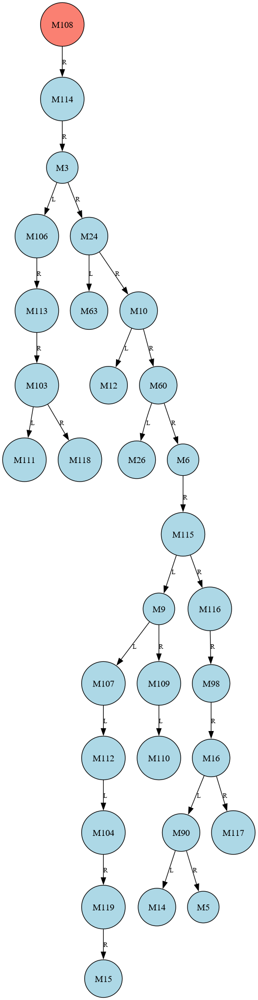
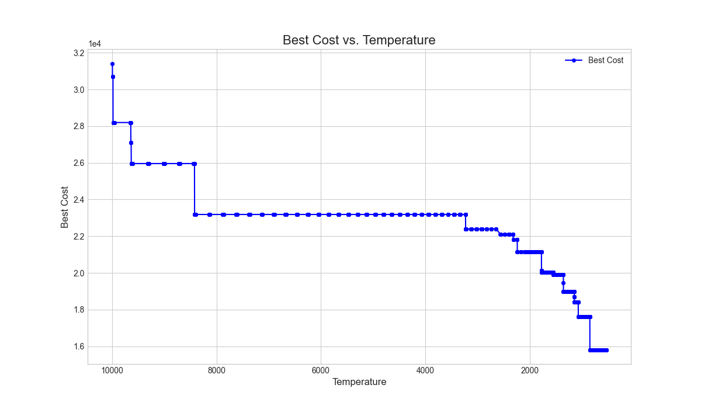
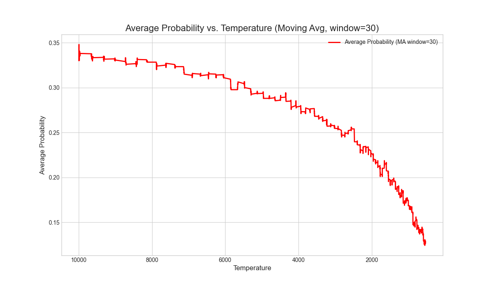

# CAD PA4 — 類比電路擺放 (Analog Placement / Floorplanning)

2025 Spring **EE6094 Computer-Aided Design (CAD)** Programming Assignment 4。
以 **B\*-tree 表示法 + 模擬退火 (Simulated Annealing, SA)** 求解類比電路的擺放問題，在最小化晶片面積與長寬比的同時，兼顧類比佈局所要求的 **INL（積分非線性 / 配對對稱性）** 成本。

> 🏆 **成果：綜合成績全班第一**（綜合面積 Area 與 連線 Cost 的評分）。

---

## 題目背景

類比電路的元件（如電晶體、電容陣列）對稱性與配對性要求很高，擺放品質直接影響電路效能。本題給定一組元件，每個元件可有**多種候選形狀**（不同的長寬與 column/row multiple 組合），要在不重疊的前提下擺放，目標為：

- 最小化晶片面積（Area）與長寬比偏差（Aspect Ratio）
- 最小化 **INL**（衡量元件配對與排列對稱性的成本）

詳細題目與評分規則請見 `doc/`：

| 文件 | 說明 |
| --- | --- |
| [doc/2025Spring_EE6094_CAD_PA4_Analog_Placement_20250506_0103.pdf](doc/2025Spring_EE6094_CAD_PA4_Analog_Placement_20250506_0103.pdf) | 題目規格 |
| [doc/PA4_explanation_release.pdf](doc/PA4_explanation_release.pdf) | 題目補充說明 |
| [doc/PA4_Checker_guide.pdf](doc/PA4_Checker_guide.pdf) | 官方 Checker 使用說明 |
| [doc/113522090_PA4_report.pdf](doc/113522090_PA4_report.pdf) | 我的實作報告 |

---

## 演算法

主程式 [113522090_PA4.cpp](113522090_PA4.cpp) 的核心流程：

1. **B\*-tree 表示法**
   - 每個節點代表一個元件；左子節點表示「緊鄰右側」的元件，右子節點表示「上方且 x 座標相同」的元件。
   - 初始隨機建樹。

2. **Packing（座標還原）**
   - 以 DFS 走訪 B\*-tree，搭配 **contour 雙向鏈結串列**（`DoublyLinkedList`）計算每個元件的實際 (x, y) 座標與當前晶片寬高。

3. **成本函數** `calculate_cost()`
   - **Area-AR 成本**：`chip_area × (1 + f_AR)`，其中 `f_AR` 對長寬比落在 `[0.5, 2]` 之外時施加懲罰。
   - **INL 成本**：`calculate_inl()` 計算元件排列的配對對稱性。
   - **總成本** = `w_area × Area-AR 成本 + w_inl × INL`。

4. **自適應權重（Warm-up）**
   - SA 前先做 5000 次取樣，量測平均 Area-AR 成本、平均 INL 與每次迭代耗時，據此自動推算權重 `w_inl = avg_AreaAR / avg_INL`，讓兩種成本量級平衡。

5. **模擬退火 (SA)**
   - 三種擾動 `perturb()`：
     - `reshape_node()`：在元件的多個候選形狀間切換
     - `swap_nodes()`：交換兩節點的元件身分
     - `delete_and_insert_node()`：刪除節點後重新插入（改變樹拓撲）
   - 降溫率由 warm-up 量測的時間預算反推（`cooling_rate = (T_min / T)^(1/steps)`）。
   - 卡住時施加「懲罰式加速降溫」，必要時暫時關閉 INL 權重以跳脫局部最佳。
   - 整體受 **~580 秒時間預算** 控制（`main()` 中 `while (elapsed < 580)`），期間持續更新並寫出目前找到的最佳解。

---

## 輸入 / 輸出格式

### 輸入：`*.block`
每行一個元件：`名稱` 後接一個或多個候選形狀 `(width height col_multiple row_multiple)`。

```
MM0 (9.11 5.54 8 1)
MM4 (1.9 18.96 1 4) (2.93 9.48 2 2) (4.99 4.74 4 1)
...
```
（`MM0` 只有一種形狀；`MM4` 有三種候選形狀可選。）

### 輸出：`*.output`
- 第 1 行：晶片面積（4 位小數）
- 第 2 行：晶片寬 高（2 位小數）
- 第 3 行：INL（2 位小數）
- 其後每行（依名稱自然排序）：`名稱 x y (width height col_multiple row_multiple)`，座標為 4 位小數

```
320.8296
20.28 15.82
15.73
MM0 7.9200 5.5400 (9.11 5.54 8 1)
MM1 0.0000 0.0000 (9.11 5.54 8 1)
...
```

---

## 編譯與執行

需要 `g++`（C++11、`-O3`、連結 `-lm`）。Windows 下可使用 MinGW-w64 或 WSL。

```bash
# 編譯
make                 # 產生執行檔 113522090_PA4

# 執行（用法：<input.block> <output.output>）
./113522090_PA4 cases/case1.block cases/out_case1.output

# 或透過 Makefile 的 run 目標
make run input=cases/case1.block output=cases/out_case1.output

# 清理編譯產物
make clean
```

> ⏱️ 程式設計為跑滿約 580 秒以盡量逼近最佳解，期間會持續把目前最佳解寫入輸出檔。

---

## 視覺化

| 腳本 | 用途 |
| --- | --- |
| [scripts/show_placement.py](scripts/show_placement.py) | 讀 `*.output` 畫出 floorplan |
| [scripts/bs_tree.py](scripts/bs_tree.py) | 由 Graphviz DOT 檔 `figures/best_tree_structure.txt` 渲染 B\*-tree 圖 |
| [scripts/sample.py](scripts/sample.py) | 解析 SA 執行日誌 `cases/case.txt`，畫出溫度 vs. 成本 / 接受機率 (MA) |
| [scripts/測資生成器.py](scripts/測資生成器.py) | 隨機產生 `*.block` 測資 |

```bash
# 需要：pip install matplotlib pandas graphviz（bs_tree.py 另需系統安裝 Graphviz）
# 以下指令請在專案根目錄執行

# 畫 floorplan
python scripts/show_placement.py cases/out_case2.output

# 畫 B*-tree
python scripts/bs_tree.py

# 畫 SA 收斂圖
python scripts/sample.py
```

以下圖均為 **case2** 的執行結果（floorplan 取自 580 秒完整解；B\*-tree 與 SA 收斂取自一次 ~25 秒短程跑解的紀錄）：

| Floorplan（case2 擺放結果） | B\*-tree |
| --- | --- |
|  |  |

| SA 溫度 vs. 成本 | SA 溫度 vs. 接受機率（MA window=30） |
| --- | --- |
|  |  |

---

## 專案結構

```
CAD_PA4/
├── 113522090_PA4.cpp        # 主程式（B*-tree + SA，正式提交版）
├── Makefile                 # 編譯 / 執行 / 清理
├── README.md
├── doc/                     # 題目規格、Checker 說明、實作報告
├── cases/                   # 測資 (*.block / *.output) 與 SA log (case.txt)
├── scripts/                 # Python 視覺化與測資生成工具
│   ├── show_placement.py, bs_tree.py, sample.py, 測資生成器.py
└── figures/                 # 視覺化結果圖 + B*-tree DOT 輸出
    ├── floorplan_visualization.png
    ├── b_star_tree_graph.png, best_tree_structure.txt
    ├── temperature_vs_cost.png, temperature_vs_probability.png
```

---

## 環境需求

- **編譯**：`g++`（支援 C++11）
- **視覺化**：Python 3 + `matplotlib`、`pandas`、`graphviz`（`bs_tree.py` 另需系統安裝 Graphviz 執行檔）
